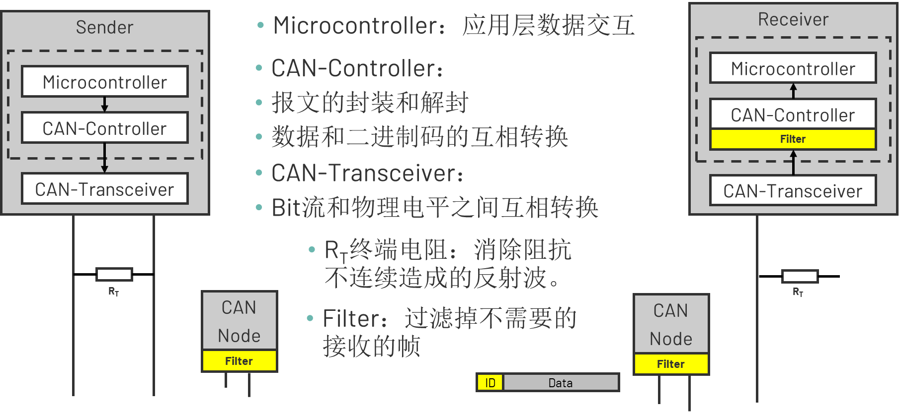
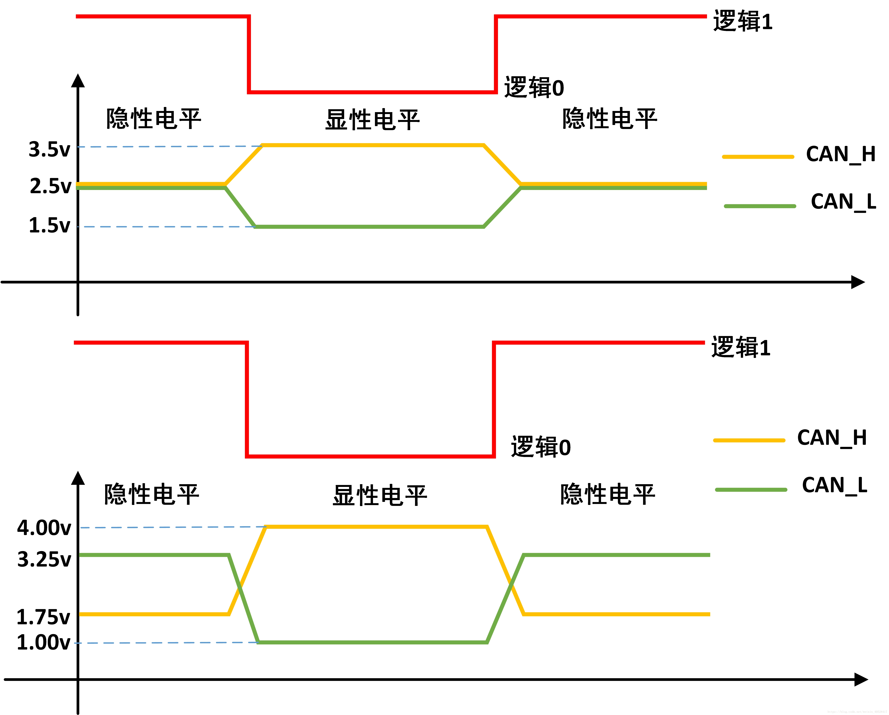
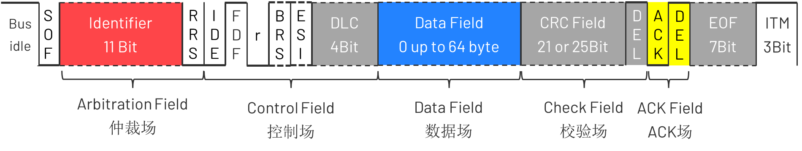
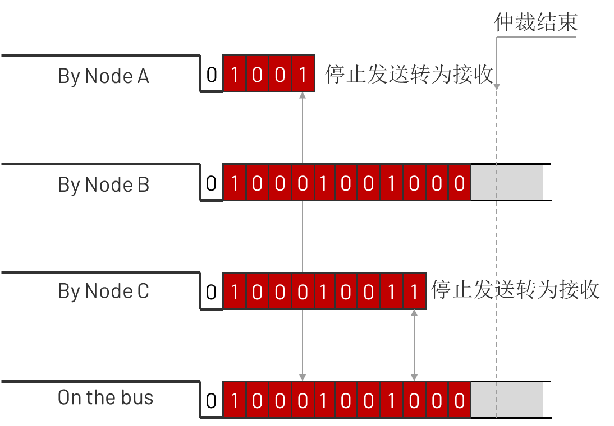
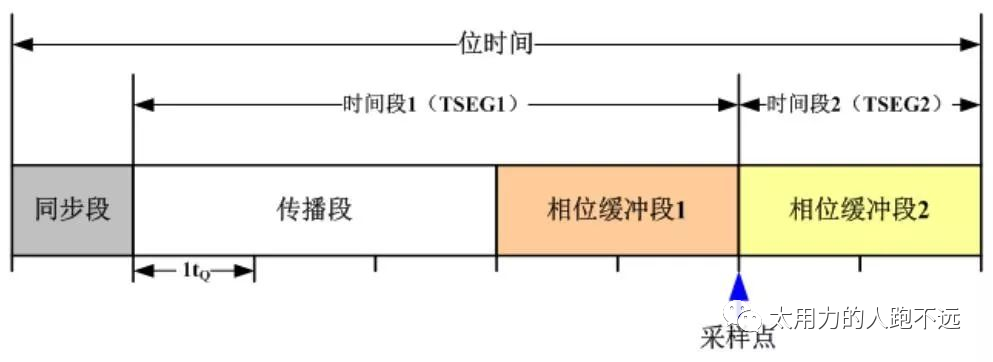
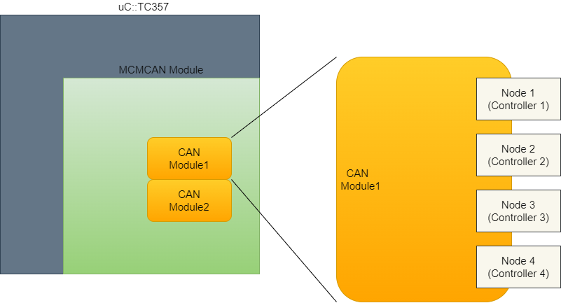
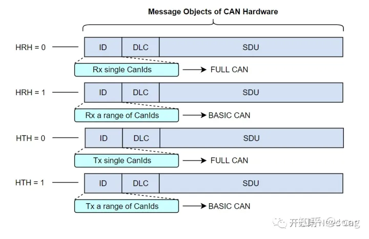
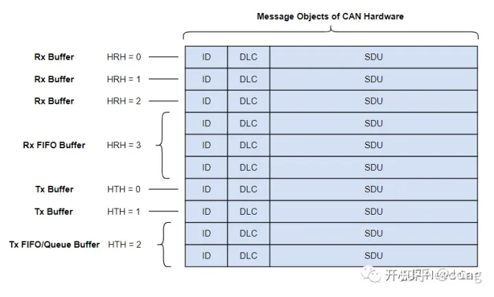
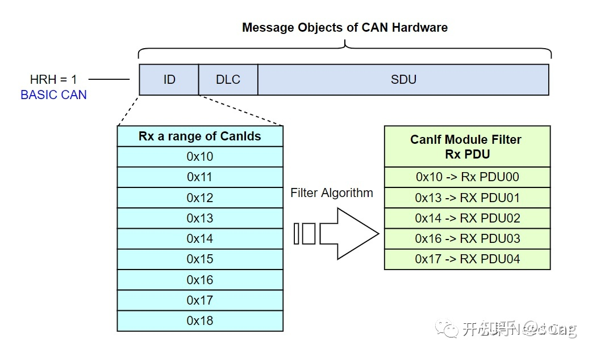
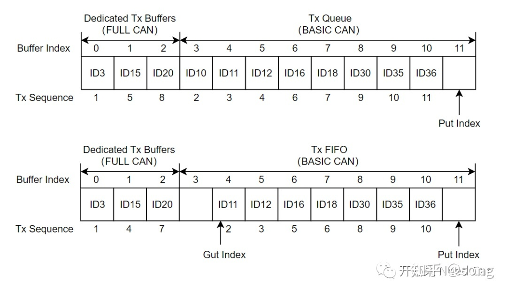

# Can Communication

- [Can Communication](#can-communication)
  - [Can Background Knowledge](#can-background-knowledge)
    - [***Brief Intro***](#brief-intro)
      - [***CAN 总线结构和控制单元***](#can-总线结构和控制单元)
      - [***CAN 总线信号***](#can-总线信号)
      - [***CanFD Standard Format***](#canfd-standard-format)
      - [***Contention-based arbitration 基于竞争的仲裁机制***](#contention-based-arbitration-基于竞争的仲裁机制)
      - [***Sample Point***](#sample-point)
      - [***同步***](#同步)
    - [DaVinci Model](#davinci-model)
      - [Can](#can)
      - [CanIf](#canif)
      - [PduR](#pdur)
      - [Com](#com)
      - [ComXf](#comxf)
      - [IpduM](#ipdum)
  - [Full Can and Basic Can](#full-can-and-basic-can)
    - [***CAN Module与CAN Node、Controller关系***](#can-module与can-nodecontroller关系)
    - [***Controller与Transceiver关系***](#controller与transceiver关系)
    - [***Controller与RAM资源关系***](#controller与ram资源关系)
    - [***Mailbox、HRH、HWObject***](#mailboxhrhhwobject)
    - [**FullCAN和BasicCAN是什么**](#fullcan和basiccan是什么)
  - [Can Bus off](#can-bus-off)
    - [Busoff Background Knowledge](#busoff-background-knowledge)
      - [***CAN 错误处理机制***](#can-错误处理机制)
        - [错误类型](#错误类型)
        - [错误计数器](#错误计数器)
        - [错误状态](#错误状态)
        - [错误恢复](#错误恢复)
    - [State Machine](#state-machine)

## Can Background Knowledge

### ***Brief Intro***

#### ***CAN 总线结构和控制单元***



#### ***CAN 总线信号***

>CAN总线上，采用差分共轭信号，通过CAN_H和CAN_L线上的电位差来表示CAN信号，分为显性电平(dominant)和隐性电平(recessive)两种类型。其中显性电平规定为逻辑0，隐性电平则为逻辑1。其具体定义可通过下图来理解。


#### ***CanFD Standard Format***



- ***SOF***: 节点发送帧时, 发送的第一个部分为帧开始的部分，表现为显性状态。这一部分被称为 SOF（Start Of Frame）。在SOF，CAN FD与CAN相同，仅有1bit的“显性”位。只有总线空闲时才允许节点发送信号，发送时，SOF将总线从隐性（1）改变为显性（0），所有节点必须同步于首先开始发送报文的节点的帧起始前沿。
  
- ***Arbitration Field***: Identifier + RRS
  - Identifier识别符可用于区别消息的同时又可以表示消息的优先级。
  - RRS位（Remote Request Substitution）远程请求替换位：即传统CAN中的RTR位。CAN FD取消了对远程帧的支持，用RRS位替换了RTR位，为常显性。

- ***Control Field***：CAN FD的控制场由IDE位、FDF位、RES位、BRS位和ESI位构成。
  - IDE位表示扩展帧标志，res位为预留位。
  - FDF位（FD Format Indicator）：
    FDF位在CAN的数据帧中位显性（0），在CAN FD的帧中常为隐形（1），表示CAN FD报文；
  - BRS位（Bit Rate Switch）：位速率转换开关
    当BRS为隐形位（1）时，表示转换可变速率，即发送节点在BRS位的采样点，将会切换到高速传输的时钟模式，其他接收节点也必须转换位时钟模式。在CRC界定符的采样点，所有节点的波特率将会再切换回仲裁场的波特率。也就是说，所有CAN FD节点都有两种类型的波特率。
  - ESI（Error State Indicator）：错误状态指示
    ESI是指示发送节点的错误状态的标志，当发送节点的错误状态是激活时，发送隐性位（1），如果错误状态未激活时，发送显性位（0）。通过ESI位，所有节点都可以确认当前的传输节点的错误状态。
  - DLC：Data Length Code

- ***Data Field***: 数据场由数据帧里的发送数据组成，在数据场中设置发送数据。首先发送最高有效位(MSB)。

- ***Check Field***: CRC + CRC Delimiter
  - CRC: 注：**CAN FD的CRC计算不仅要包括数据段的位，还包括来自SOF的Stuff Count和填充位。**
  - CRC Delimiter: CRC界定符是表示CRC校验场的结束。

- ***ACK Field***：CAN FD的ACK应答场包括应答间隙和应答界定符，其构成和CAN是相同的。不同的是，在CAN中，应答场的长度是1位，但在CAN FD，接收节点利用2位时间将其识别为有效应答。
由从高速的数据场到慢速的仲裁场时，时钟切换会引起收发器相移和总线传播延迟。为了补偿其相移和延迟，相比传统的CAN，在CAN FD中多加了这额外的1位时间。在ACK之后，发送ACK界定符。这是一个表示ACK结束的分隔符，为是1位隐性位。

- ***EOF***: 每一个数据帧均由一标志序列界定，这个标志序列由7个“隐性”位组成。CAN FD的帧结尾与CAN相同。

#### ***Contention-based arbitration 基于竞争的仲裁机制***

>- 由硬件特性决定，被称为线与得仲裁机制。ID越小的信号优先级越高。


- 线与机制

|Node A|Node B|Bus Level|
|:---:|:---:|:---:|
|0|0|0|
|0|1|0|
|1|0|0|
|1|1|1|

- 回读机制

|发送端|总线|解释|
|:---:|:---:|:---:|
|0|0|继续发送|
|0|1|错误    |
|1|0|停止发送|
|1|1|继续发送|

#### ***Sample Point***



1. 位时序
    首先我们需要了解Tq的概念，Tq是can控制器的最下时间周期称作时间份额（Time quantum，简称Tq）,它是通过芯片晶振周期分频而来。传输的个bit位由若干个Tq组成。一个位可分为4段，分别为：
   - 同步段(SS：Synchronization Segment)
   - 传播时间段(PTS：Propagation Time Segment)
   - 相位缓冲段1(PBS1：Phase Buffer Segment 1)
   - 相位缓冲段2(PBS2：Phase Buffer Segment 2)

2. 采样点
    $$
    Sample Point = \frac{(1+TSEG1)}{(1+TSEG1+TSEG2)}
    $$

3. 延迟(TDC)
   SSP：二次采样点。用于估算收发延迟。*Ref. AURIXTC3XX_um_part2_v1.2.0*

   > During the data phase of a CAN FD transmission only one node is transmitting, all others are receivers. The length of the bus line has no impact. When transmitting via pin TXD the protocol controller receives the transmitted data from its local CAN transceiver via pin RXD. The received data is delayed by the CAN transmitter delay. In case this delay is greater than TSEG1 (time segment before sample point), a bit error is detected. In order to enable a data phase bit time that is even shorter than the transmitter delay, the delay compensation is introduced. Without transmitter delay compensation, the bit rate in the data phase of a CAN FD frame is limited by the transmitter dela.
   >
   > The received bit is compared against the transmitted bit at the Secondary Sample Point. The Secondary Sample Point position is defined as the sum of the measured delay from the M_CAN’s transmit output TX through the transceiver to the receive input RX plus ***the transmitter delay compensation offset as configured by TDCRi (i=0- 3).TDCO***. The transmitter delay compensation offset is used to adjust the position of the SSP inside the received bit (e.g. half of the bit time in the data phase). The position of the secondary sample point is rounded down to the next integer number of mtq.PSRi.TDCV shows the actual transmitter delay compensation value. PSRi (i=0- 3).TDCV is cleared when CCCRi.INIT is set and is updated at each transmission of an FD frame while DBTPi (i=0- 3).TDC is set.

  

#### ***同步***

CAN同步的策略CAN同步是以位为单位，每接收一个下降沿，则进行一次同步。发送单元以约定好的位时序进行数据发送。接收单元根据总线上接收到的下降沿进行位时序同步。
但是，发送节点和接收节点作为互相独立的硬件个体，时钟频率误差、传输路径上的（电缆、驱动器等）相位延迟等都会引起时序偏差。因此接收单元需通过硬同步或者重同步的方法进行位时序调整。

1、硬同步：接收单元在总线空闲状态检测出第一个下降沿时（对应报文的SOF下降沿）进行的同步调整。在检测到SOF的下降沿时，直接将此下降沿的位置认为是SS段，然后按照位时序对信号进行采样，达到同步的效果。

2、重同步：硬同步只是在总线空闲时检测出下降沿（帧起始）时进行，后续CAN报文数据位的同步则需要通过调整位时序来进行重同步。在接收过程中检测出总线上的下降沿来临时，根据SJW值通过加长PBS1段，或缩短PBS2段，以调整同步。但如果发生了超出SJW值的误差时，最大调整量不能超过SJW值。

### DaVinci Model

#### Can

Can模块中一些配置项介绍：

|Item|Description|Reference|
|:---|:---|:---|
|Basis Address Enum|当前节点使用的是哪一个Can Controller.|TechnicalReference_CAN_Tricore_MCAN.pdf Chapter 6.2 && AURIXT3XX_um_part2_V1.2.0 Page 1940|
|Common CAN|允许使用两个物理Can通道作为一个CAN节点，扩展了Buffer。前提是硬件支持。||
|TTCAN|Can的高层协议，实时性更高，TC397支持，TC357不支持||
|Enable optimizations for hardware buffer lengths|FullCAN对象的硬件缓冲区被限制为实际要接收的消息的帧长度。如果接收到帧长较大的CAN-FD消息，驱动程序可能会丢弃这些消息。如果禁用此功能，则将硬件缓冲区配置为能够接收所有消息的最大大小。||
|Interrupt Category|1和2都是做为中断函数直接由OS管理。2只支持AutoSar/OSEK OS||
|Interrupt Lock|中断由哪个模块管理。|TechnicalReference_CAN_Tricore_MCAN.pdf Chapter 6.2|
|Rx Queue |||
|Safe Bsw Checks|  This attribute has to be enabled for safety projects where this component is mapped to an ASIL partition.||

#### CanIf

- Tx Buffer Handling Type: 一般选择PRIO_BY_CANID即可, 但有些情况例外，比如有复用信号时。因为PRIO_BY_CANID的Buffer使用的是O(1)的查表法。

#### PduR

- 整个模块是一张路由器表，描述了每个Ipdu从那里来到那里去的信息。一般由DaVinci自行生成即可。

#### Com

- 负责收发Ipdu的模块。

#### ComXf

- 归一化Signal Group，方便E2E的计算

```C
typedef struct DataTypeA
{
    u8_t Data_1;
    u8_t Data_2;
    u8_t CRC;
}
typedef struct DataTypeB
{
    u8_t Data_2;
    u8_t Data_1;
    u8_t CRC;
}
```

如果直接使用以上两个结构体声明的变量，他们计算出的CRC是不一样的，因此需要由ComXf统一起来。

#### IpduM

1. *DBC配置*

   将选择信号配置为Multiplexor Signal, 动态部分配置为Multiplexd Signal，静态部分配置为Signal。

   ***Multiplexor Signal必须是Enum类型，并且需要独立于Signal Group之外。***

   

   Multiplexed Signal还需要配置Multiplex Value, 即对应Multiplexor Signal的哪个值。所有配置了相同Multiplex Value的Signals会被组合成一个Ipdu。

   

   导入DaVinci后即可正确生成IpduM模块。

   \****一些局限性*** :

   - DaVinci无法为复用信号生成E2E检查
   - DaVinci默认扩展Ipud Group的周期

2. *DaVinci 配置项*

   - IpduM:

     - Tx Trigger Mode: 一般选择DYNAMIC_PART_TRIGGER.即动态数据更新后IpduM模块就会将数据发送到下一层。

   - Com：

     - ComConfig->ComIPdus:

       - Tx Mode Time Offset && Tx Mode Time Period: 每个Ipdu的发送时间和周期，生成的默认值不契合我们的软件策略，需要手动修改。

   - Rte:

     - IpduM有自己的MainFunction, 需要在RTE中指定Main function的位置。为保证实时性，建议尽量靠近Com Main function.

3. *功能简介*

IpduM模块负责将从COM接收到的适当的Signal与发送回发送端路由器的新的多路复用I-PDU相结合。在接收端，它负责解释多路复用I-PDU的内容，并考虑选择器字段的值，通过I-PDU为COM提供适当的分离I-PDU。IpduM有一个选择字段，选择字段可以根据多路器的需要来配置，长度为1 bit - 16 bits之间，典型的选择字段的长度是4bits。

---

## Full Can and Basic Can

### ***CAN Module与CAN Node、Controller关系***

在芯片手册中（Data Sheet），一个CAN Module会包含多个Node（即，Controller）。比如：TC357芯片手册中，MCMCANModule包含2个CAN Module，每个Module包含4个Controller，如下所示：



### ***Controller与Transceiver关系***

在实际的使用中，一个Controller必须配一个Transceiver，Controller+Transceiver = Network，如下所示：


所以，平时我们口语话的“3路CAN”是指3个Controller+Transceiver组合，即：3个Network，我们也常称“3个节点”。

### ***Controller与RAM资源关系***

刚提到，TC357中，一个CAN Module包含4个Controller，那每个Controller可以发送多少个CAN报文，接收多少个CAN 报文呢？这里我们要区分硬件缓存CAN报文的数量和项目中要求发送/接收报文的数量。

硬件缓存CAN报文数量：是指上层请求发送报文或者接收报文时，CAN驱动最多能缓存的数量；
项目中要求发送/接收报文的数量：是指当前节点要外发或者接收的报文数量。
以发送CAN报文数量为例：需求要求当前网络节点发送100帧CanID不同的CAN报文，实际该节点CAN Controller可用的硬件发送缓存区最多有32，意味着底层硬件最多缓存32帧发送报文，如果超过32帧发送请求，则会因没有硬件空间缓存而发送请求失败。

TC357 CAN Module资源情况如下所示：*Ref. TC35X_um_appx_V1.1.0.pdf*


提示：上图中的Controller用“Node”表示。由上可以看出，２个CAN Module，共８个Controller。每个CAN Controller可用32个发送Tx Buffer...对于发送缓冲区，每个CAN Controller可用32个发送缓冲区，如果配置了32个Tx Dedicated Buffer，则没有空间配置Tx FIFO/Queue。一般，Tx Buffer配置时，会混合使用，比如：

20 Tx Dedicated Buffer+ 12 Tx Queue
MCMCANModule RAM区地址划分顺序如下所示：*Ref. AURIXTC3XX_um_part2_v1.2.0*


### ***Mailbox、HRH、HWObject***

**Mailbox**：邮箱，就是CAN驱动所具有的接收缓存区和发送缓存区，接收缓存区和发送缓存区均在RAM区。

**HWObject**：硬件对象，包含CAN ID、DLC、Data等信息的RAM区。

**HRH**：Hardware Receive Handle，接收句柄，一个HRH表示一个接收HWObject。

**HTH**：Hardware Transmit Handle，发送句柄，一个HTH表示一个发送HWObject。

Mailbox、HWObject、HRH、HTH、Controller、Transceiver之间的关系如下所示：


### **FullCAN和BasicCAN是什么**

首先，FullCAN和BasicCAN是CanIf模块配置的参数。

*BasicCAN*：一个HWObject(Hardware Object)可以处理一段范围的CanId
*FullCAN*：一个HWObject(Hardware Object)只能处理单个CanId

Autosar对FullCAN和BasicCAN的解释如下所示：

>A CAN mailbox(Hardware Object) for FullCAN operation only enables transmission or reception of single CanIds. Accordingly, BasicCAN operation of one Hardware Object enables to transmit or receive a ranage of CanIDs.

将上述的解释进一步细化，如下所示：



使用工程中，MCAL会将缓存区分配成FIFO和Dedicated Buffer，FIFO和Dedicated Buffer的区别是什么呢？Dedicated Buffer区域，Hareware Object与HRH/HTH一一对应，而FIFO区域，一个HRH/HTH对应多个Hareware Object，如下所示：



为什么需要FullCAN和BasicCAN？
在CAN驱动层，可以通过过滤的方式，过滤一段范围内的CanID，也就是说：会有一段范围内的报文接收进来，但是接收进来的这一段范围的报文并不一定都是上层所需要的，怎么办呢？用软件方式，再过滤一遍，由CanIf过滤所需要的CAN报文。因此，提出了FullCAN和BasicCAN的概念。

比如：HRH对应BASIC CAN类型，接收CanID范围：0x10~0x18，CanIf根据过滤算法，在0x10~0x18范围内过滤出需要的0x10、0x13、0x14、0x16、0x17送给上层，而其余的丢弃，如下所示：



CanIf可以通过设置CANIF_HRHRANGE_LOWER_CANID、CANIF_HRHRANGE_UPPER_CANID方式过滤，也可以通过设置CANIF_HRHRANGE_BASEID、CANIF_HRHRANGE_MASK进行过滤。

不同报文类型如何选择FULL CAN/BASIC CAN
应用报文：一般选择配置成FULL CAN类型，对于应用报文，一般不需要缓存，使用最新接收的数据即可。对于发送的应用报文，都配置成FULL CAN类型需要一个前提：上层需要发送应用报文数量＜底层硬件缓存区数量。比如：底层发送硬件缓存区数量为32，节点需要发送的应用报文数量为50，显然无法将50个发送的应用报文都配置成FULL CAN。遇到这种情况，一般会将重要的应用报文配置成FULL CAN，而其他要发送的应用报文配置成BASIC CAN。这样配置以后，硬件缓存区的分配就需要混用，即：Dedicated Tx Buffers+Tx Queue或者 Dedicated Tx Buffers+Tx FIFO，如下所示：



如上图，ID3、ID15、ID20是比较重要的应用报文，配置成FULL CAN，分别给一个独立的缓存区；其他的缓存区则配置成BASIC CAN，即：一个缓存区可以发送多个不同CanID的报文。

诊断报文：一般选择配置成BASIC CAN类型（结合FIFO Buffer使用），因为诊断报文的请求/响应不能错序，需按照顺序处理，且数据不能覆盖；

网络管理报文：接收一般选择配置成BASIC CAN类型，因为一个节点一般会要求接收一段范围的网络管理报文，eg:0x500~0x53F。发送网络管理报文配置成FULL/BASIC CAN类型均可，如果资源够用，推荐配置成FULL CAN类型，因为每个节点的发送网络管理报文唯一；

---

## Can Bus off

### Busoff Background Knowledge

#### ***CAN 错误处理机制***

##### 错误类型

- Error detection 错误检测
  - Bit monitoring 位监控
  - Stuff rule check 填充规则检测
  - Frame form check帧格式检测
  - 15 bit CRC CRC校验
  - ACK check 响应检测

- Error signalling 错误告知
  - error frame 发送错误帧
  - Negative ACK回复隐性ACK

- Error Correction 错误纠正
  - 重发

##### 错误计数器

||接收喝发送错误计数器值得变动条件|发送错误计数器值(TEC)|接收错误计数器值(REC)|
|:---:|:---|:---:|:---:|
|1|接收单元检测出错误时|-|+1|
|2|接收单元在发送完错误标志位后检测到得第一个标志为显性电平|-|+8|
|3|发送单元在输出错误标志时|+8|-|
|4|发送单元在发送主动错误标志或过载标志时，检测出位错误|+8|-|
|5|接收单元在发送主动错误标志或过载标志时，检测出位错误|-|+8|
|6|各单元从主动错误标志、过载标志的最开始检测出连续14个位的显性位时。之后，每检测出连续的8个位的显性位时。|+8|+8|
|7|检测出在被动标志位后追加的连续8个位的显性位时|+8|+8|
|8|发送单元正常发送数据结束时|-1|-|
|9|接收单元正常接收数据结束时|-|$$1<=REC<=127$$时-1,REC>127,设 REC=127|
|10|处于Bus Off的单元，检测到128次连续11个位的隐性位|TEC=0|TEC=0|

##### 错误状态

对于错误界定，节点存在如下三种状态：

主动错误
被动错误
总线关闭


- 主动错误：
处于主动错误状态的节点能正常参与总线通信的收发，当检测到错误时将发送主动错误标志，错误标志由6个连续的显性位组成（这种连续的6个显性位与常规的填充位和其它帧固定格式不相同，正因为如此，硬件才容易区别）。
如果是发送节点发送主动错误帧，这种情况相当于刚刚发送的那帧报文我发错了，我现在主动破坏它，其他节点不管接收到什么都不算数；
如果是接收节点发送主动错误帧，这种情况相当于刚刚接收的那帧报文出错了，我现在主动站出来告诉大家这个错误，并把这帧报文破坏掉，刚才你们不管接收到什么都不算数
**Tips：处于主动错误状态，说明这个节点目前是比较可靠的，出现错误的原因可能不是它本身的问题，即刚刚检测到的错误可能不仅仅只有它检测到，正因为如此，整个总线才允许它破坏正在发送中的报文。**

- 被动错误：
处于被动错误状态的节点不能发送主动错误标志。它能参与正常通信，但当检测到错误时发送的是被动错误标志。被动错误标志由6个连续的隐性位组成。当发送结束后，处于被动错误状态的节点在下一次再次发送时之前需要等待一些额外时间。
如果是发送节点发出被动错误帧，刚刚被发送的报文被破坏。错误帧发送完成后，接着的是帧间隔（3个隐性位）和“传输延时段”（8个隐性位），这时总线上的其他节点就可以判断总线处于空闲状态并参与总线竞争。这种机制可以让其他处于主动错误状态的节点优先使用总线。
如果是接收节点发出被动错误帧，则不会对总线产生任何影响。
**Tips：处于被动错误状态，说明这个节点目前是不可靠的，出现错误的原因可能是它本身的问题，即刚刚检测到的错误可能只有它自己检测到，正因为如此，整个总线不会信任它的报告，从而只允许它发送6个连续的隐性位，这样才不会拖累其他节点。**

- 总线关闭：
处于总线关闭状态的节点不允许发送和接收任何形式的帧报文。且只能通过用户请求进行恢复。

***如果总线上只有一个节点，该节点发送数据帧后得不到应答，TEC最大只能计数到128，即这种情况下节点只会进入被动错误状态而不会进入总线关闭状态。***

##### 错误恢复

节点进入总线关闭状态后，普遍采用的是 **快慢恢复** 的形式：

1. 立即重新初始化 CAN 芯片；

2. t(tBusOffQuick 或 tBusOffSlow)时间内应暂停发送报文，分为快速恢复和慢速恢复；

3. 恢复到正常 CAN 通信


### State Machine  


